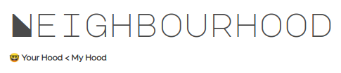

--------------------
[](https://nbhood.herokuapp.com/)

# Prerequisites & Dependencies
- <a href="https://nodejs.org/en/">Node.js</a>
- <a href="https://developer.mozilla.org/en-US/docs/Web/API/Geolocation_API">Geolocation API</a>
- <a href="https://leafletjs.com/">Leaflet.js</a>
- <a href="https://expressjs.com/en/starter/installing.html">Express</a>
- <a href="https://github.com/louischatriot/nedb">NeDB</a>
- <a href="https://devcenter.heroku.com/articles/heroku-cli">Heroku CLI</a>
- <a href="https://www.google.com/chrome/">Google Chrome</a>

<b>Note - </b> Use `Google Chrome` for Geolocation accessibilty. I've tested with `Firefox` but it's not working.

# Getting Started
Make sure you have <a href="https://nodejs.org/en/">Node.js</a>. The easiest way to get started is to clone the repository:

```sh
# Get the latest one
git clone https://github.com/niyazed/neighbourhood.git

# Change directory
cd neighbourhood

# Install NPM dependencies
npm install

# Then simply start your app
node index.js
```
Your app should now be running on <b>localhost:3000</b>.

**Note:** I highly recommend installing [Nodemon](https://github.com/remy/nodemon).
It watches for any changes in your  node.js app and automatically restarts the
server. Once installed, instead of `node app.js` use `nodemon app.js`. It will
save you a lot of time in the long run, because you won't need to manually
restart the server each time you make a small change in code. To install, run
`sudo npm install -g nodemon`.

Contributing
------------

If something is unclear, confusing, or needs to be refactored, please let me know.
Pull requests are always welcome, but open an issue before
submitting a pull request.

License
-------

MIT License

Copyright (c) 2020 Niyaz Bin Hashem

Permission is hereby granted, free of charge, to any person obtaining a copy
of this software and associated documentation files (the "Software"), to deal
in the Software without restriction, including without limitation the rights
to use, copy, modify, merge, publish, distribute, sublicense, and/or sell
copies of the Software, and to permit persons to whom the Software is
furnished to do so, subject to the following conditions:

The above copyright notice and this permission notice shall be included in all
copies or substantial portions of the Software.

THE SOFTWARE IS PROVIDED "AS IS", WITHOUT WARRANTY OF ANY KIND, EXPRESS OR
IMPLIED, INCLUDING BUT NOT LIMITED TO THE WARRANTIES OF MERCHANTABILITY,
FITNESS FOR A PARTICULAR PURPOSE AND NONINFRINGEMENT. IN NO EVENT SHALL THE
AUTHORS OR COPYRIGHT HOLDERS BE LIABLE FOR ANY CLAIM, DAMAGES OR OTHER
LIABILITY, WHETHER IN AN ACTION OF CONTRACT, TORT OR OTHERWISE, ARISING FROM,
OUT OF OR IN CONNECTION WITH THE SOFTWARE OR THE USE OR OTHER DEALINGS IN THE
SOFTWARE.
